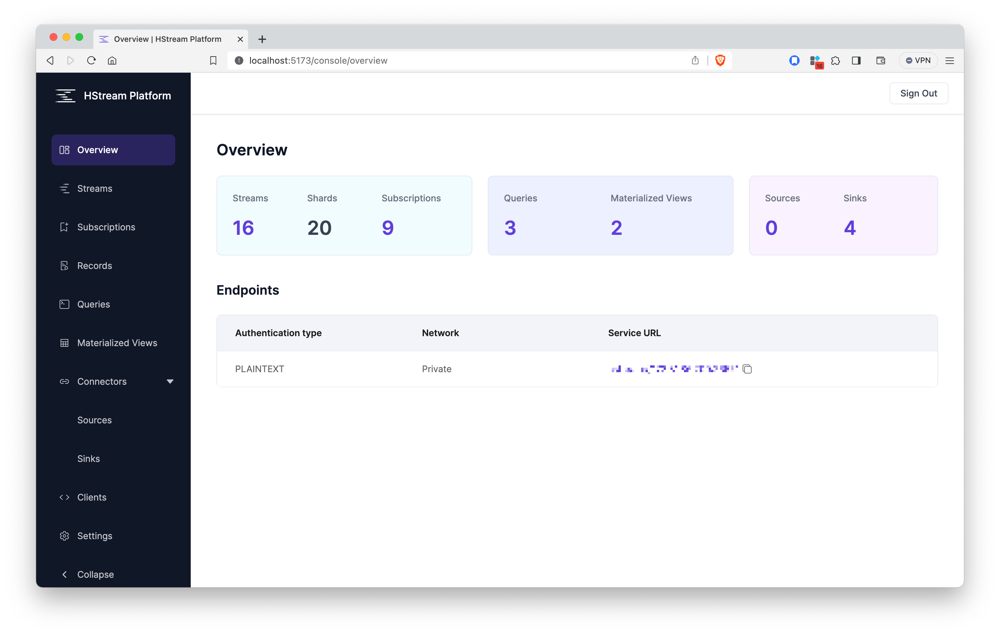

# 在 HStream Console 上开始

HStream Console 是 HStreamDB 的基于网络的管理工具。它提供了一个图形用户界面，用于管理 HStreamDB 集群。
通过 HStream Console ，您可以轻松创建和管理流（streams），以及编写 SQL 查询以实时处理数据。除了操作 HStreamDB，
HStream Console 还为集群中的每个资源提供了指标，帮助您监视集群的状态。

## 特点

### 直接管理 HStreamDB 资源

HStream Console 提供了一个图形用户界面，用于直接管理 HStreamDB 的资源，包括流、订阅和查询。
您可以轻松在集群中创建和删除资源、向流中写入数据以及编写 SQL 查询以处理数据。

它还可以帮助您搜索集群中的资源，并提供每个资源的详细视图。

### 监视集群中的资源

在每个资源视图中，HStream Console 提供了一个度量面板，用于实时监视资源状态。借助度量面板，
您可以直观地可视化资源状态，并轻松找出集群的瓶颈所在。

### 数据同步

借助 HStream Console 中的连接器，您可以实现在 HStreamDB 和其他数据源（如 MySQL、PostgreSQL 和 Elasticsearch）之间同步数据的能力。
请查看 [HStream IO 概览](../ingest-and-distribute/overview.md) 以了解有关连接器的更多信息。

## 下一步操作

要了解有关 HStreamDB 资源的更多信息，请点击以下链接：

- [流 (Streams)](../write/stream.md)
- [订阅 (Subscriptions)](../receive/subscription.md)
